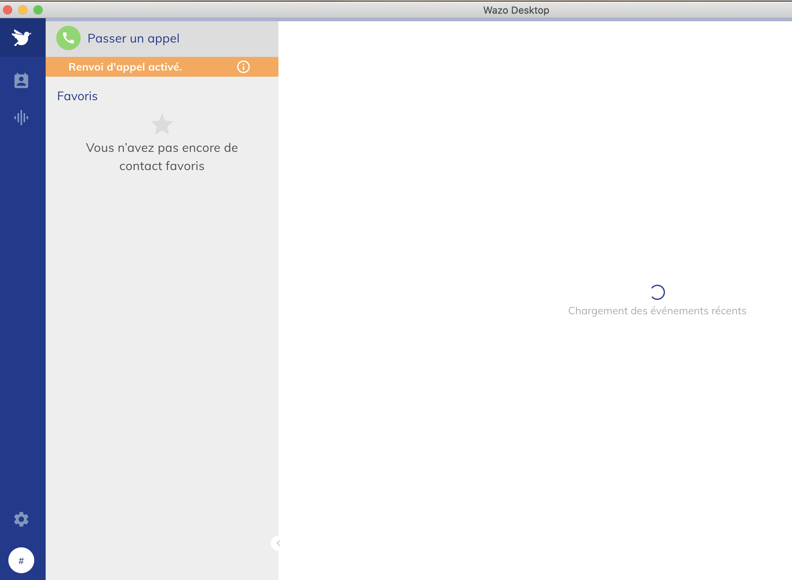
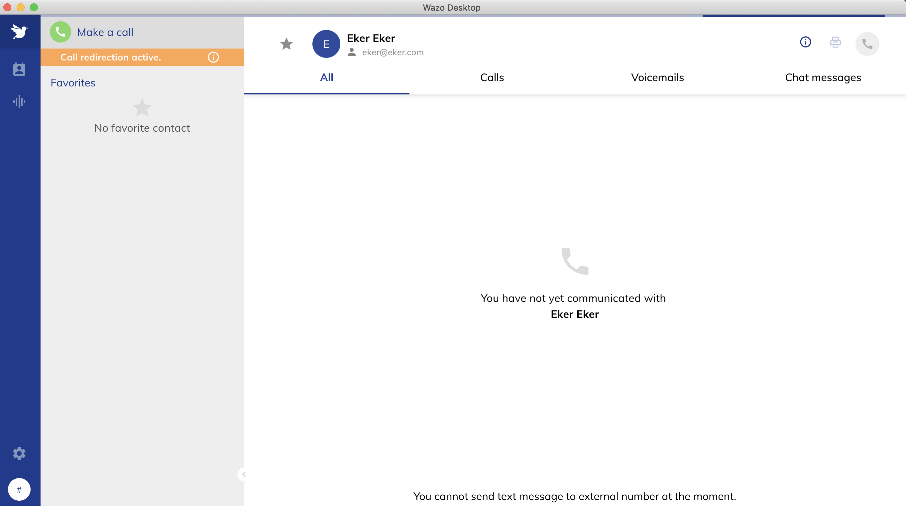

# Wazo Desktop Reverse Engineering

Sadece wazo'nun desktop uygulamasını görmek için tasarladığım bir yapı. İçeriksel olarak zaten çalıştıramadım ancak girişi yaptırabildim.


Giriş başarılı olduktan sonraki parse işleminde ne değerine aşağıdaki verilerek giriş yaptırılabilir.

```
ne = [{rules: [{name: 'application-client-access'}],}]
```





